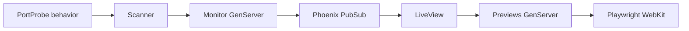

# LocalWebMonitorex

Painel local para acompanhar aplicações web nas portas 4000–4100. Descobre serviços HTTP a cada 5 segundos, mostra somente as portas ativas e atualiza miniaturas enquanto o painel está aberto. A porta 4000 tem um atalho permanente.

Local-first dashboard for monitoring web applications running on your own computer.

## Começar

Requisitos: Elixir 1.15+ e Erlang/OTP compatível, Node.js 20+, npm e macOS para a instalação automática. O projeto usa Phoenix LiveView e Playwright WebKit. Não precisa de banco de dados.

```bash
mix deps.get
npm ci --prefix assets
./assets/node_modules/.bin/playwright install webkit
mix assets.build
mix phx.server
```

Abra [localhost:4020](http://localhost:4020). O servidor escuta apenas em `127.0.0.1`. A própria porta do painel é retirada da lista observada.

### Iniciar com o macOS

```bash
./bin/install-launch-agent
```

O instalador compila os assets de produção, cria um LaunchAgent do usuário e inicia o serviço. Ele volta a iniciar no login. Para parar e remover a inicialização automática:

```bash
./bin/uninstall-launch-agent
```

O log fica em `~/Library/Logs/LocalWebMonitorex.log`. A preferência de porta permanece após desinstalar o LaunchAgent.

## Mudar a porta do painel

Abra **Configurações** no painel, escolha uma porta entre 1024 e 65535 e salve. A mudança vale no próximo reinício do processo. A preferência fica em `~/.config/localwebmonitorex/port` ou em `$XDG_CONFIG_HOME/localwebmonitorex/port`. Defina `LOCALWEBMONITOREX_CONFIG` para usar outro arquivo. A variável `PORT`, quando definida, tem prioridade sobre a preferência salva.

Para escolher antes do primeiro início, crie o arquivo com apenas o número da porta:

```bash
mkdir -p ~/.config/localwebmonitorex
printf '4321\n' > ~/.config/localwebmonitorex/port
```

O intervalo observado é configurado em `config/config.exs` por `monitor_ports`. O painel usa a faixa configurada na interface.

## Como funciona



- `PortProbe.Http` acessa somente loopback, não segue redirecionamentos e limita o tempo de resposta. O `Scanner` limita a concorrência a 16 portas.
- `Monitor` publica o conjunto atual de serviços. Ele não inicia nem encerra aplicações encontradas.
- `Previews` captura uma página de cada vez, a cada 30 segundos no máximo por porta, enquanto existe uma sessão conectada. A navegação da captura é limitada a URLs locais. Algumas páginas protegidas por login ou dependentes de recursos externos podem mostrar apenas seu estado inicial.
- As miniaturas ficam em um diretório temporário do processo. A porta escolhida para o painel fica em um arquivo persistente de configuração.

## Desenvolvimento

```bash
mix test
mix format --check-formatted
mix compile --warnings-as-errors
```

Veja `AGENTS.md` e `CLAUDE.md` para as convenções do repositório, adaptadas dos padrões gerais do Forrozin.

## Licença

MIT. Veja `LICENSE`.
