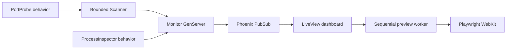

# LocalWebMonitorex

**Your localhost, at a glance.** LocalWebMonitorex is a small Phoenix LiveView dashboard that finds the web apps running on your computer and gives each one a live card. See the port, page preview, HTTP status, response time, and—when the operating system exposes it—the listening process, CPU usage, and resident memory. Open any app with one click.

[](https://github.com/sallaumen/LocalWebMonitorex/actions/workflows/ci.yml) [](LICENSE)


<sub>The screenshots use three sample apps, a temporary 4055–4057 demo range, and dashboard port 4381. They contain no contributor applications or private local pages.</sub>

## Why use it?

- **Find servers as they come and go.** Ports 4000–4100 are checked every 5 seconds by default. Only responding web apps appear; the dashboard excludes its own port.
- **Recognize a page before opening it.** WebKit captures previews sequentially while a dashboard tab is connected, with at least 30 seconds between captures of the same port.
- **See the process behind a port.** On systems with `lsof` and `ps`, cards show the listener's executable, PID, CPU percentage, and resident memory. Missing permissions or tools are shown as unavailable data.
- **Keep everything on your machine.** The server binds to `127.0.0.1`. There is no account, database, or remote monitoring service.
- **Start with your Mac.** A user LaunchAgent can build the app and start it at login.


## Quick start

You need Elixir 1.15+ with a compatible Erlang/OTP version, Node.js 20+, npm, and Playwright WebKit. On macOS, `lsof` and `ps` are already available. They are optional on other systems; service discovery still works without process metrics.

```bash
git clone https://github.com/sallaumen/LocalWebMonitorex.git
cd LocalWebMonitorex
mix deps.get
npm ci --prefix assets
./assets/node_modules/.bin/playwright install webkit
mix assets.build
mix phx.server
```

Open **[http://localhost:4020](http://localhost:4020)**. Port 4020 is the dashboard default. Port 4000 is an ordinary monitored port, not the dashboard address. Open the URL using `localhost`; the Phoenix LiveView connection uses that host.

### Start automatically on macOS

```bash
./bin/install-launch-agent
```

The installer prepares production assets, installs a user LaunchAgent, and starts the app. It runs again at login. To restart it after saving a new dashboard port in **Settings**:

```bash
launchctl kickstart -k gui/$(id -u)/com.localwebmonitorex
```

The log is at `~/Library/Logs/LocalWebMonitorex.log`. To stop and remove automatic startup:

```bash
./bin/uninstall-launch-agent
```

Uninstalling the LaunchAgent keeps your saved port preference.

## Configuration

Open **Settings** to save a dashboard port from 1024 to 65535. It takes effect on the next process start. The preference contains only a port number and lives at `~/.config/localwebmonitorex/port`, or under `$XDG_CONFIG_HOME/localwebmonitorex/port`. Set `LOCALWEBMONITOREX_CONFIG` to choose another preference file. The `PORT` environment variable takes priority over the saved value.

To choose a port before the first start:

```bash
mkdir -p ~/.config/localwebmonitorex
printf '4321\n' > ~/.config/localwebmonitorex/port
```

The watched range is `monitor_ports` in [`config/config.exs`](config/config.exs). The dashboard shows the configured range and always excludes its own port from discovery.

## How it works



The HTTP probe checks loopback only, limits timeouts, and does not follow a discovered service's redirect to another host. The scanner checks at most 16 ports concurrently. Process inspection runs one `lsof` command and one `ps` command per scan when web services were found. The metrics describe the **listener process**, not a port's isolated resource use; a process listening on multiple ports may appear on multiple cards.

Previews are requested only by connected dashboard sessions. Browser navigation and assets are limited to local HTTP(S) addresses. Captures are stored in an OS temporary directory and never committed or uploaded by the app. Login-protected pages and apps that depend on remote assets may show an incomplete initial view.

## Development

```bash
mix test
mix format --check-formatted
mix compile --warnings-as-errors
MIX_ENV=prod mix assets.deploy
```

The project conventions in [`AGENTS.md`](AGENTS.md) and [`CLAUDE.md`](CLAUDE.md) adapt quality guidance from Forrozin to this local utility. The source is licensed under [MIT](LICENSE).
