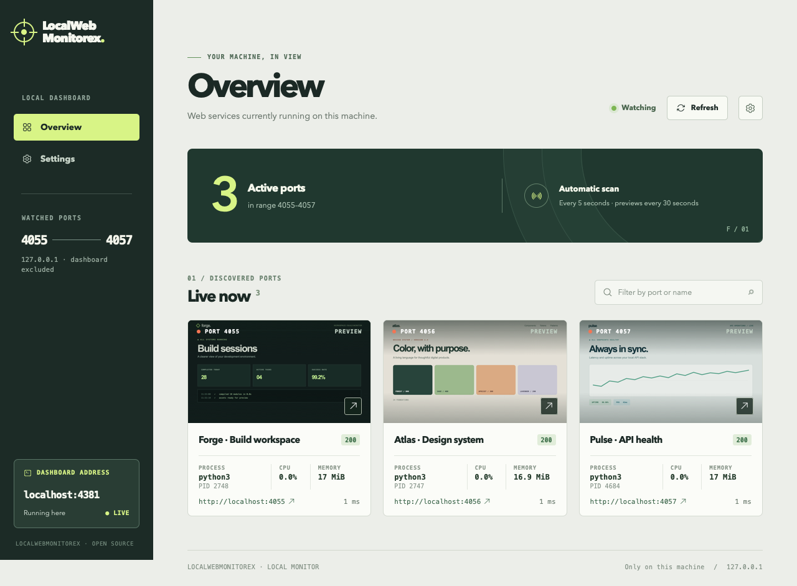
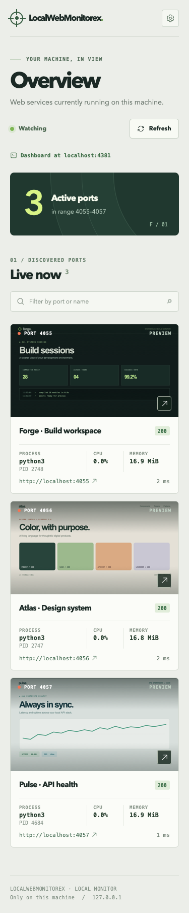
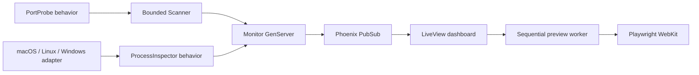

# LocalWebMonitorex

**Your localhost, at a glance.** LocalWebMonitorex is a small Phoenix LiveView dashboard that finds the web apps running on your computer and gives each one a live card. See the port, page preview, HTTP status, response time, and—when the operating system exposes it—the listening process, CPU usage, and resident memory. Open any app with one click.

[](https://github.com/sallaumen/LocalWebMonitorex/actions/workflows/ci.yml) [](LICENSE)



<sub>The screenshots use three sample apps, a temporary 4055–4057 demo range, and dashboard port 4381. They contain no contributor applications or private local pages.</sub>

## Why use it?

- **Find servers as they come and go.** Ports 4000–4099 are checked every 5 seconds by default. Only responding web apps appear; the dashboard excludes its own port.
- **Recognize a page before opening it.** WebKit captures previews sequentially while a dashboard tab is connected, with at least 30 seconds between captures of the same port.
- **See the process behind a port.** The OS adapter adds the listener's name, PID, CPU percentage, and resident memory when available. Missing permissions or tools are shown as unavailable data.
- **Keep everything on your machine.** The server binds to `127.0.0.1`. There is no account, database, or remote monitoring service.
- **Start with your Mac.** A user LaunchAgent can build the app and start it at login.

| Platform | Dashboard and previews | Process details | Login startup |
| --- | --- | --- | --- |
| macOS | Supported | PID, CPU, memory via `lsof` and `ps` | LaunchAgent installer |
| Linux | Supported | PID, CPU, memory when `lsof` and `ps` are installed | Manual setup |
| Windows | Supported through PowerShell | PID and memory through `Get-NetTCPConnection` and `Get-Process`; CPU shown as unavailable | Manual setup |



## Quick start

You need Elixir 1.15+ with a compatible Erlang/OTP version, Node.js 20+, npm, and Playwright WebKit. The process tools are optional; service discovery still works without process metrics. See the official [Elixir installation guide](https://elixir-lang.org/install/) and [Playwright browser guide](https://playwright.dev/docs/browsers) for platform prerequisites.

On macOS or Linux:

```bash
git clone https://github.com/sallaumen/LocalWebMonitorex.git
cd LocalWebMonitorex
mix deps.get
npm ci --prefix assets
./assets/node_modules/.bin/playwright install webkit
mix assets.build
mix phx.server
```

Open **[http://localhost:4100](http://localhost:4100)**. Port 4100 is the dashboard default; ports 4000–4099 are watched. Open the URL using `localhost`; the Phoenix LiveView connection uses that host.

On Windows, use PowerShell after installing Elixir/Erlang, Node.js, and Git:

```powershell
git clone https://github.com/sallaumen/LocalWebMonitorex.git
Set-Location LocalWebMonitorex
mix deps.get
npm ci --prefix assets
.\assets\node_modules\.bin\playwright.cmd install webkit
mix assets.build
mix phx.server
```

The dashboard opens at the same `http://localhost:4100` address. If a screenshot tool is unavailable, the card remains usable and shows a preview placeholder. Automatic login startup is currently provided only for macOS.

### Start automatically on macOS

```bash
./bin/install-launch-agent
```

The installer copies the app to `~/Library/Application Support/LocalWebMonitorex`, prepares production assets there, installs a user LaunchAgent, and starts it. This lets the background process run outside protected project folders such as Documents. It starts again at login. Re-run the installer after pulling project updates. To restart it after saving a new port or watched range in **Settings**:

```bash
launchctl kickstart -k gui/$(id -u)/com.localwebmonitorex
```

The log is at `~/Library/Logs/LocalWebMonitorex.log`. To stop and remove automatic startup:

```bash
./bin/uninstall-launch-agent
```

Removing the LaunchAgent keeps the installed copy and your saved preferences.

## Configuration

Open **Settings** to change the dashboard port or watched range. Both changes take effect on the next process start. The dashboard port accepts 1024–65535 and defaults to **4100**. The watched range is inclusive, defaults to **4000–4099**, accepts ports 1–65535, and is limited to 1,000 ports per scan. The dashboard always excludes its own port even when it falls inside the watched range.

Preferences are two plain text files: `port` contains one port number, and `range` contains `START-END`. They live in `~/.config/localwebmonitorex/` on macOS/Linux or `%APPDATA%\LocalWebMonitorex\` on Windows. Unix users can set `XDG_CONFIG_HOME`. Set `LOCALWEBMONITOREX_CONFIG` to choose a different port file; the range file defaults to its sibling `range`. Set `LOCALWEBMONITOREX_RANGE_CONFIG` to override that path. The `PORT` environment variable takes priority over the saved dashboard port.

To choose a port before the first start:

```bash
mkdir -p ~/.config/localwebmonitorex
printf '4321\n' > ~/.config/localwebmonitorex/port
printf '4000-4099\n' > ~/.config/localwebmonitorex/range
```

The dashboard shows the active range. Invalid preference contents fall back to the built-in defaults.

## How it works



The HTTP probe checks loopback only, limits timeouts, and does not follow a discovered service's redirect to another host. The scanner checks at most 16 ports concurrently. The macOS/Linux adapter runs one `lsof` and one `ps` command per scan when web services were found; the Windows adapter makes one PowerShell query. The metrics describe the **listener process**, not a port's isolated resource use; a process listening on multiple ports may appear on multiple cards. PowerShell's process CPU property is cumulative time, so the Windows adapter deliberately leaves live CPU percentage unavailable.

Previews are requested only by connected dashboard sessions. Browser navigation and assets are limited to local HTTP(S) addresses. Captures are stored in an OS temporary directory and never committed or uploaded by the app. Login-protected pages and apps that depend on remote assets may show an incomplete initial view.

## Development

```bash
mix test
mix format --check-formatted
mix compile --warnings-as-errors
MIX_ENV=prod mix assets.deploy
```

The project conventions in [`AGENTS.md`](AGENTS.md) and [`CLAUDE.md`](CLAUDE.md) adapt quality guidance from Forrozin to this local utility. The source is licensed under [MIT](LICENSE).
